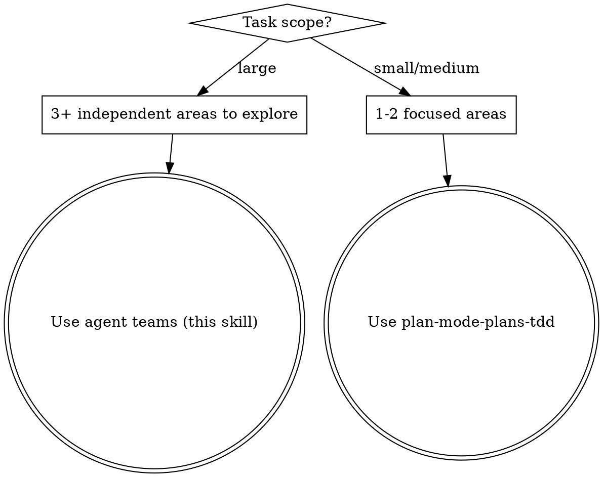
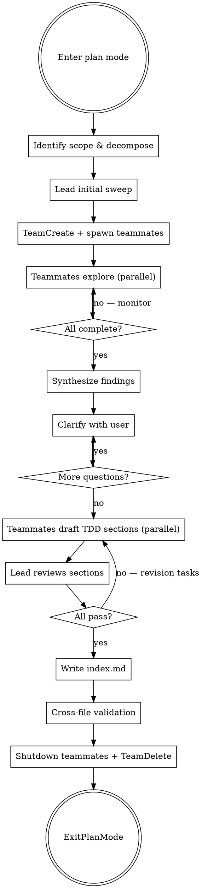

# Plan Mode Plans (Agent Teams + TDD)

## Overview

Write specific, actionable, **self-contained** plans in plan mode using an **agent team** for parallel exploration, with **TDD-structured steps** in each section file. The plan must be usable by a fresh session with zero prior context.

**Core principles:**
- The lead orchestrates, teammates explore and draft in parallel
- Plans are always split into multiple files
- If you didn't watch the test fail, you don't know if it tests the right thing — no production code without a failing test first

**Prerequisite:** Agent teams must be enabled via `CLAUDE_CODE_EXPERIMENTAL_AGENT_TEAMS` in settings or environment.

## When to Use Agent Teams vs Single Session



**Use agent teams when:**
- The task spans 3+ independent areas (layers, domains, subsystems)
- Single-session exploration would exhaust context before drafting begins
- Different areas require deep, independent investigation

**Use single session when:**
- The task is focused on 1-2 areas
- Areas are tightly coupled
- The codebase is small enough to explore fully in one session

## Process Flow



## Phase 1: Identify Scope & Decompose

Before reading anything, state:
- **What** needs to change (feature/fix/refactor)
- **Where** it likely lives (educated guess from project structure)
- **What you don't know** yet (explicit unknowns)

Then choose a **decomposition strategy** and define teammate roles:

### Decomposition Strategies

| Strategy | When to Use | Example Roles |
|---|---|---|
| **By layer** | Full-stack feature spanning multiple layers | data-layer, api-routes, ui-components, tests |
| **By domain** | Feature touching multiple bounded contexts | auth-domain, billing-domain, notification-domain |
| **By file area** | Large refactor touching many directories | src/models/, src/views/, src/services/ |
| **By concern** | Cross-cutting changes | core-logic, error-handling, migration, documentation |
| **By dependency chain** | Ordered work with clear prerequisites | schema-first → API → client → UI |

**Aim for 3-5 teammates.** If you can't define 3 independent areas, use single-session `plan-mode-plans-tdd` instead.

### Test Infrastructure Teammate

**Recommended** (not required) when:
- The project has complex test setup (custom runners, shared fixtures, CI-specific config)
- Multiple section files need to reference the same test helpers
- New test utilities need to be created for this task

When included, the test infrastructure teammate:
- Explores: test framework config, shared helpers/factories/fixtures, CI test commands, coverage tooling, mock/stub patterns (or request recording tools like VCR/OHHTTPStubs)
- Writes their section as `01-test-infrastructure.md` — first in order, since other sections depend on it
- Other teammates' section-drafting tasks should depend on this section (via `addBlockedBy` in `TaskUpdate`) so they can reference discovered test helpers and conventions

For each teammate, define:
- **Name/label** — descriptive, e.g. "data-layer-explorer"
- **Exploration area** — which files, directories, and concerns they investigate
- **Section they'll draft** — the plan section file they'll own

## Phase 2: Agent Team Exploration

### Lead Initial Sweep

Before spawning teammates, the lead does a brief structural scan (Glob/Grep only, not deep reads):
- Project structure and entry points
- Validate that the decomposition strategy makes sense
- Identify any shared code that multiple teammates will need to know about

This should be quick — just enough to write good spawn prompts. Deep exploration is the teammates' job.

### Create Team and Spawn Teammates

1. Create the team with `TeamCreate` (creates shared task list at `~/.claude/tasks/{team-name}/`)
2. Spawn each teammate using the `Agent` tool with `team_name` and `name` parameters
3. Create tasks for each teammate via `TaskCreate`, then assign with `TaskUpdate` (set `owner` to teammate name)

**Every teammate spawn prompt MUST include:**

1. **Overall goal** — what the full task is (the teammate needs big-picture context)
2. **Their specific area** — exactly which files, directories, and concerns to explore
3. **Plan directory path** — where to write their section file
4. **Section filename** — their numbered section file (e.g., `02-api-routes.md`)
5. **Exploration standards** — teammates must follow these minimum exploration steps:
   - Find all relevant files (Glob/Grep)
   - Read actual code (not just file names) — functions, interfaces, types
   - Trace data flow through relevant paths
   - Check for existing patterns — how does the codebase handle similar things?
   - Find tests and test infrastructure for their area
   - **TDD-specific:** Identify test framework, runner, test file conventions, helpers, fixtures, and existing test patterns
   - Fetch external references if needed — library docs, API references
   - Link the origin — GitHub issue, PR, or conversation motivating this work
6. **Section file format** — the exact TDD template for their output (see Phase 4)
7. **Shared context** — any findings from the lead's initial sweep that affect their area

### Exploration Red Flags — Go Back and Read More

These apply to both the lead and teammates:
- You're about to write "update the relevant files" without naming them
- You reference a function you haven't read
- You assume an interface shape without checking
- You don't know where tests live for this area
- You haven't checked how similar features were implemented
- You looked up docs/syntax during exploration but haven't saved the key findings anywhere yet
- There's a GitHub issue or PR motivating this work and you haven't linked it
- **TDD-specific:** You don't know the test command, test file naming pattern, or available helpers

### Monitoring and Synthesis

- Monitor teammate progress via `TaskList` (checks shared task list at `~/.claude/tasks/{team-name}/`)
- Read completed section files as they come in
- After all teammates complete, synthesize:
  - Check for overlapping Files Affected between sections
  - Identify contradictory Decisions or Assumptions
  - Resolve conflicts (choose one recommendation with rationale, or flag for Phase 3)
  - Merge Files Affected into a unified aggregate for the index

**Conflict resolution rules:**
- Two sections modify the same file → reconcile changes (order, merge, or re-split ownership)
- Contradictory assumptions → escalate to user in Phase 3
- One section's approach invalidates another → lead rewrites affected steps

### Teammate Communication

Teammates can message each other directly via `SendMessage` (type: `"message"`, specifying `recipient` by teammate name). If a teammate discovers something that affects another teammate's area, they should message the relevant teammate and note the cross-cutting concern in their section's Dependencies.

Use `SendMessage` with type `"broadcast"` sparingly — only for critical issues that affect all teammates.

## Phase 3: Clarify With the User

**After exploration, ALWAYS ask clarifying questions before drafting.** The lead now has synthesized findings from all teammates to draw on.

**What to surface:**
- **Ambiguities** — anything with multiple valid interpretations
- **Trade-offs discovered** — present options with pros/cons from what teammates found
- **Assumptions you're about to make** — state them explicitly
- **Scope questions** — things that could be in or out
- **Cross-cutting conflicts** — where teammates disagreed on approach
- **Mocking decisions** — do not use mocks unless the user explicitly approves. If the project uses request recording tools (VCR, OHHTTPStubs, etc.), use those instead. Ask here if unsure.

**How to ask:**
- Use AskUserQuestion with concrete options informed by exploration
- One question at a time — don't dump a wall of questions
- Lead with your recommendation when you have one

**When you think there's nothing to ask**, ask yourself: "If I draft this plan and they reject it, what would the reason be?" That's your question.

## Phase 4: Multi-File Plan Output with TDD Steps

### Plan Directory Structure

```
plans/{plan-name}/
  index.md              # Master index (lead-authored)
  01-{section-slug}.md  # Teammate-drafted sections with TDD cycles
  02-{section-slug}.md
  03-{section-slug}.md
  ...
```

### index.md Format

The master index is authored by the lead and contains:

```markdown
## Goal
[One sentence. What does "done" look like?]

## Context
- **Issue:** [Link to GitHub issue, ticket, or description of the request — omit if none]
- **Related code:** [Links to PRs, existing implementations, or examples referenced]

## Documentation Referenced
- [Library/API name](URL) — [what was learned]
[Merged from all teammate findings]

## Skills & Tools
- **Skills:** [List skills the executing session should invoke]
- **Tools:** [List MCP servers, CLI tools, or specific tooling needed]

## Assumptions
[Merged from all sections, conflicts resolved]

## Decisions
| Decision | Options Considered | Chosen | Rationale |
|---|---|---|---|
[Merged decision table, conflicts resolved with rationale]

## Section Map
| # | Section | File | Owner | Status |
|---|---|---|---|---|
| 1 | Test Infrastructure | 01-test-infrastructure.md | test-explorer | Complete |
| 2 | Data Layer | 02-data-layer.md | data-layer-explorer | Complete |
| 3 | API Routes | 03-api-routes.md | api-explorer | Complete |

## Files Affected
[Merged aggregate from all section files]

## Approach
[2-4 paragraphs — how all sections fit together, implementation order, integration points]

## Synthesis
[Cross-cutting decisions and conflict resolutions]

## Risks
[Only genuinely unknowable things]
```

### Section File Format (TDD)

Each teammate writes their section file with TDD-structured steps:

```markdown
## {Section Name}

### Scope
[What this section covers — specific directories, concerns, boundaries]

### Files Affected
- `exact/path/to/file.ts:45-67` — [what changes and why]

### Key Syntax & Patterns
[API signatures, code patterns relevant to this section. Inline the actual syntax.]

### Dependencies
- **Depends on:** [other section names — must be implemented first]
- **Blocks:** [other section names — cannot start until this is done]

### Steps
```

Instead of generic steps, each feature/change is a TDD cycle:

````markdown
#### Cycle 1: [Behavior being tested]

**RED — Write failing test**

File: `tests/exact/path/test_file.ts`

```typescript
test('rejects empty email with validation error', () => {
  const result = validateEmail('');
  expect(result).toEqual({ valid: false, error: 'Email is required' });
});
```

**Verify RED**

```bash
npm test tests/exact/path/test_file.ts
```

Expected failure: `validateEmail is not defined` (function doesn't exist yet)

**GREEN — Minimal implementation**

File: `src/exact/path/validation.ts`

```typescript
export function validateEmail(email: string): ValidationResult {
  if (!email.trim()) {
    return { valid: false, error: 'Email is required' };
  }
  return { valid: true };
}
```

**Verify GREEN**

```bash
npm test tests/exact/path/test_file.ts
```

All tests pass.

**REFACTOR** (if needed)

[Describe any cleanup, or "None needed" if implementation is already clean]

**Commit**

```bash
git add src/exact/path/validation.ts tests/exact/path/test_file.ts
git commit -m "feat(validation): Add email presence validation"
```

---

#### Cycle 2: [Next behavior]
...
````

### TDD Cycle Rules

These rules are non-negotiable in the plan:

1. **Test code comes first in every cycle.** The test snippet MUST appear before the implementation snippet.
2. **Every cycle needs a verify step.** Both RED and GREEN need explicit verification commands with expected output. The executing session must confirm the test fails for the right reason (not a syntax error) and passes after implementation.
3. **Minimal implementation only.** The GREEN snippet should be the simplest code that makes the test pass. Future cycles handle additional features.
4. **One behavior per cycle.** If you find yourself writing "and" in the cycle name, split it.
5. **No mocks unless the user says so.** Plan tests that exercise actual functions and return values.

### Ordering Cycles

Structure cycles within each section so each builds on the last:

1. **Happy path first** — the simplest valid case
2. **Edge cases** — empty input, boundaries, special characters
3. **Error cases** — invalid input, failure modes
4. **Integration** — how components work together

Each cycle should produce a commit. Frequent, small commits.

### Code Snippet Requirements

**Snippets must be real code, not wishful thinking:**
- Use actual function names, types, and signatures from exploration
- Match the project's existing test style and conventions
- Include imports if they're non-obvious
- Never include placeholder comments like `// TODO: figure this out`

If you can't write the snippet, you haven't explored enough. Go back to Phase 2.

### Specificity Requirements

| Vague (reject) | Specific (accept) |
|---|---|
| "Update the handler" | "Add validation to `handleSubmit` in `src/components/Form.tsx:34`" |
| "Add tests" | "Add test case to `tests/form.test.ts` using the existing `renderForm` helper" |
| "Modify the type" | "Extend `UserProfile` in `src/types.ts:12` with optional `displayName: string`" |

**Rule:** If a step doesn't include a file path, it's not specific enough.

### Lead Review Gates

Before accepting a teammate's section file, the lead checks:

| Check | Fail Condition | Action |
|---|---|---|
| Specificity | Steps without file paths | Create revision task via `TaskCreate` |
| Snippets | Placeholder comments instead of real code | Create revision task via `TaskCreate` |
| Self-containment | References files or functions not explored | Create revision task via `TaskCreate` |
| TDD format | Missing RED/GREEN verify commands or expected failure | Create revision task via `TaskCreate` |
| Cycle granularity | Cycle tests multiple behaviors | Create revision task — split it |
| Test commands | Inconsistent test commands across sections | Standardize against test infra section |

If a section fails review, the lead creates a follow-up task via `TaskCreate` and messages the teammate via `SendMessage` with the feedback.

## Phase 5: Write, Cleanup, and Exit

1. Verify all section files are written to the plan directory
2. Verify `index.md` is written with complete merged view
3. **Cross-file self-containment test** (see below)
4. Shut down all teammates via `SendMessage` (type: `"shutdown_request"`)
5. Clean up the team via `TeamDelete` after all teammates confirm shutdown
6. Call ExitPlanMode for user approval

## The Self-Containment Test

Before calling ExitPlanMode, ask yourself:

> If a fresh session reads ONLY the index.md and section files with zero prior context, can it start implementing immediately without looking anything up?

Common gaps:
- API syntax you verified during exploration but didn't inline
- Library documentation you consulted but only linked (link AND quote the key parts)
- GitHub issue context that motivated design decisions
- Assumptions that feel "obvious" because you just explored the code
- Code snippets that reference functions or types you haven't verified exist
- A section references another section's work without explaining what it needs

**TDD-specific self-containment checks:**
- Does each cycle include the exact test command to run?
- Does each RED step include the expected failure message?
- Could the executing session run each cycle mechanically without judgment calls?
- Are test file paths and conventions consistent with what exploration found?
- If a test infrastructure section exists, do other sections reference its helpers correctly?

## Common Mistakes

| Mistake | Fix |
|---|---|
| Start writing plan before exploring | Explore FIRST. Read files, trace code paths |
| Reference files you haven't read | Read every file you mention in the plan |
| Plan says "update" without specifics | Name the function, line, and exact change |
| Looked up docs but didn't inline findings | The executing session won't have your exploration context |
| Steps describe code changes but have no snippets | Every code-changing step needs a concrete snippet |
| "Open questions" in Risks section | If you could have asked the user or looked it up, it's not a risk |
| Spawn prompt missing overall context | Teammate explores blindly. Always include the full task goal. |
| Too many teammates (>5) | Coordination overhead exceeds benefit. 3-5 is the sweet spot. |
| Lead does all exploration instead of delegating | Lead does a brief sweep, teammates do the deep work. |
| No synthesis step | Section files contradict each other. Always synthesize before Phase 3. |
| Sections have overlapping Files Affected without reconciliation | Lead must reconcile. |
| Forgot to shut down teammates and TeamDelete | Always clean up the team before ExitPlanMode. |
| Writing implementation before test in a cycle | Test comes first. Always. Reorder the cycle. |
| Test that can't actually fail | Write a test that exercises new behavior. |
| Cycle tests multiple behaviors | Split into separate cycles. One assertion focus per cycle. |
| No verify commands | Every RED and GREEN needs a runnable command with expected output |
| GREEN implementation is over-engineered | Write the simplest code that passes. Refactor later. |
| Skipping commit between cycles | Each cycle = one commit. |
| Using mocks without user approval | No mocks unless the user explicitly says so. |
| No test infra teammate, sections invent different patterns | Add a test infra teammate or have lead standardize in index.md |
| Section TDD cycles reference helpers from an unimplemented section | Use Dependencies to order implementation. Test infra goes first. |
