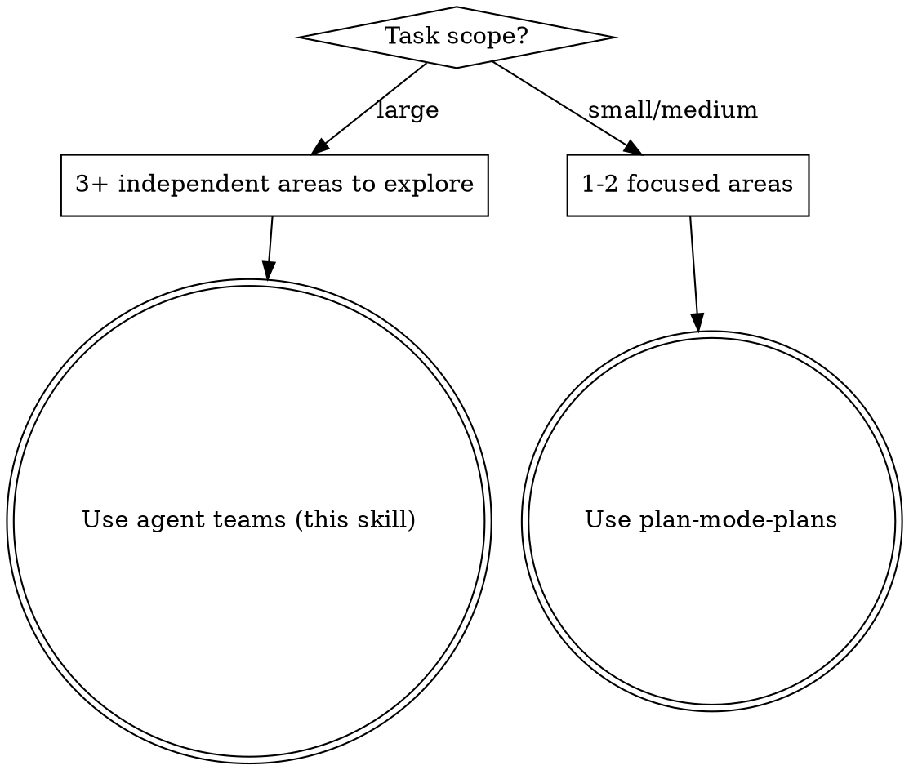
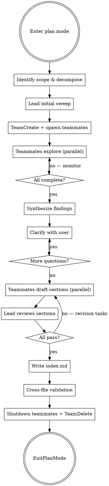

# Plan Mode Plans (Agent Teams)

## Overview

Write specific, actionable, **self-contained** plans in plan mode using an **agent team** for parallel exploration. The plan must be usable by a fresh session with zero prior context — if you looked something up during exploration, the findings go **in the plan**.

**Core principle:** The lead orchestrates, teammates explore and draft in parallel. Each teammate owns one area of the codebase and one section of the plan. Plans are always split into multiple files.

**Prerequisite:** Agent teams must be enabled via `CLAUDE_CODE_EXPERIMENTAL_AGENT_TEAMS` in settings or environment.

## When to Use Agent Teams vs Single Session



**Use agent teams when:**
- The task spans 3+ independent areas (layers, domains, subsystems)
- Single-session exploration would exhaust context before drafting begins
- Different areas require deep, independent investigation
- A large refactor touches many directories with different patterns

**Use single session when:**
- The task is focused on 1-2 areas
- Areas are tightly coupled (teammates would constantly need each other's findings)
- The codebase is small enough to explore fully in one session

## Process Flow



## Phase 1: Identify Scope & Decompose

Before reading anything, state:
- **What** needs to change (feature/fix/refactor)
- **Where** it likely lives (educated guess from project structure)
- **What you don't know** yet (explicit unknowns)

Then choose a **decomposition strategy** and define teammate roles:

### Decomposition Strategies

| Strategy | When to Use | Example Roles |
|---|---|---|
| **By layer** | Full-stack feature spanning multiple layers | data-layer, api-routes, ui-components, tests |
| **By domain** | Feature touching multiple bounded contexts | auth-domain, billing-domain, notification-domain |
| **By file area** | Large refactor touching many directories | src/models/, src/views/, src/services/ |
| **By concern** | Cross-cutting changes | core-logic, error-handling, migration, documentation |
| **By dependency chain** | Ordered work with clear prerequisites | schema-first → API → client → UI |

**Aim for 3-5 teammates.** Each teammate should have a clear, independent exploration scope. If you can't define 3 independent areas, use single-session `plan-mode-plans` instead.

For each teammate, define:
- **Name/label** — descriptive, e.g. "data-layer-explorer"
- **Exploration area** — which files, directories, and concerns they investigate
- **Section they'll draft** — the plan section file they'll own

## Phase 2: Agent Team Exploration

### Lead Initial Sweep

Before spawning teammates, the lead does a brief structural scan (Glob/Grep only, not deep reads):
- Project structure and entry points
- Validate that the decomposition strategy makes sense
- Identify any shared code that multiple teammates will need to know about

This should be quick — just enough to write good spawn prompts. Deep exploration is the teammates' job.

### Create Team and Spawn Teammates

1. Create the team with `TeamCreate` (creates shared task list at `~/.claude/tasks/{team-name}/`)
2. Spawn each teammate using the `Agent` tool with `team_name` and `name` parameters
3. Create tasks for each teammate via `TaskCreate`, then assign with `TaskUpdate` (set `owner` to teammate name)

**Every teammate spawn prompt MUST include:**

1. **Overall goal** — what the full task is (the teammate needs big-picture context)
2. **Their specific area** — exactly which files, directories, and concerns to explore
3. **Plan directory path** — where to write their section file
4. **Section filename** — their numbered section file (e.g., `02-api-routes.md`)
5. **Exploration standards** — teammates must follow these minimum exploration steps:
   - Find all relevant files (Glob/Grep)
   - Read actual code (not just file names) — functions, interfaces, types
   - Trace data flow through relevant paths
   - Check for existing patterns — how does the codebase handle similar things?
   - Find tests and test infrastructure for their area
   - Fetch external references if needed — library docs, API references
   - Link the origin — GitHub issue, PR, or conversation motivating this work
6. **Section file format** — the exact template for their output (see Phase 4)
7. **Shared context** — any findings from the lead's initial sweep that affect their area

**Example spawn prompt structure:**
```
You are exploring the data layer for a task to [overall goal].

Your area: [specific directories, files, concerns]

Explore following these standards:
- Find all relevant files using Glob/Grep
- Read the actual code — functions, interfaces, types
- Trace how data flows through [specific paths]
- Check how similar things are handled in the codebase
- Find existing tests and test patterns for this area
- Fetch docs for [relevant libraries] if needed

Shared context from lead:
- [Key findings from initial sweep]

Write your findings as a plan section to: plans/{plan-name}/02-data-layer.md
Use this format:
[section file template]
```

### Exploration Red Flags — Go Back and Read More

These apply to both the lead and teammates:
- You're about to write "update the relevant files" without naming them
- You reference a function you haven't read
- You assume an interface shape without checking
- You don't know where tests live for this area
- You haven't checked how similar features were implemented
- You looked up docs/syntax during exploration but haven't saved the key findings anywhere yet
- There's a GitHub issue or PR motivating this work and you haven't linked it

### Monitoring and Synthesis

- Monitor teammate progress via `TaskList` (checks shared task list at `~/.claude/tasks/{team-name}/`)
- Read completed section files as they come in
- After all teammates complete, synthesize:
  - Check for overlapping Files Affected between sections
  - Identify contradictory Decisions or Assumptions
  - Resolve conflicts (choose one recommendation with rationale, or flag for Phase 3)
  - Merge Files Affected into a unified aggregate for the index

**Conflict resolution rules:**
- Two sections modify the same file → reconcile changes (order, merge, or re-split ownership)
- Contradictory assumptions → escalate to user in Phase 3
- One section's approach invalidates another → lead rewrites affected steps

### Teammate Communication

Teammates can message each other directly via `SendMessage` (type: `"message"`, specifying `recipient` by teammate name). If a teammate discovers something that affects another teammate's area, they should message the relevant teammate and note the cross-cutting concern in their section's Dependencies.

Use `SendMessage` with type `"broadcast"` sparingly — only for critical issues that affect all teammates (e.g., "the project uses a completely different framework than expected, everyone stop and reassess").

## Phase 3: Clarify With the User

**After exploration, ALWAYS ask clarifying questions before drafting.** Even if the task seems clear — exploration often reveals ambiguities, trade-offs, or assumptions worth verifying. It's cheaper to ask now than to rewrite the plan or waste an execution cycle.

The lead now has synthesized findings from all teammates to draw on.

**What to surface:**
- **Ambiguities** — anything with multiple valid interpretations
- **Trade-offs discovered** — present options with pros/cons from what teammates found in the code
- **Assumptions you're about to make** — state them explicitly and ask if they're correct
- **Scope questions** — things that could be in or out
- **Cross-cutting conflicts** — where teammates disagreed on approach, present both recommendations with the lead's analysis

**How to ask:**
- Use AskUserQuestion with concrete options informed by exploration
- One question at a time — don't dump a wall of questions
- Lead with your recommendation when you have one
- Keep going until you're confident you understand the intent

**When you think there's nothing to ask**, ask yourself: "If I draft this plan and they reject it, what would the reason be?" That's your question.

**Before moving to Phase 4**, check: "Am I about to put anything in a 'Risks' or 'Open Questions' section that I could resolve right now by asking?" If yes, ask it here.

## Phase 4: Multi-File Plan Output

### Plan Directory Structure

Plans always use a directory with an index and numbered section files:

```
plans/{plan-name}/
  index.md              # Master index (lead-authored)
  01-{section-slug}.md  # Teammate-drafted sections
  02-{section-slug}.md
  03-{section-slug}.md
  ...
```

The plan-name directory replaces the single `{plan-name}.md` file. Numbered prefixes enforce reading and implementation order. Section slugs are descriptive (e.g., `01-data-layer.md`, `02-api-routes.md`).

### index.md Format

The master index is authored by the lead and contains:

```markdown
## Goal
[One sentence. What does "done" look like?]

## Context
- **Issue:** [Link to GitHub issue, ticket, or description of the request — omit if none]
- **Related code:** [Links to PRs, existing implementations, or examples referenced]

## Documentation Referenced
- [Library/API name](URL) — [what was learned]
[Merged from all teammate findings]

## Skills & Tools
- **Skills:** [List skills the executing session should invoke]
- **Tools:** [List MCP servers, CLI tools, or specific tooling needed]

## Assumptions
[Merged from all sections, conflicts resolved]
- [Assumption 1 — what we believe to be true and why]

## Decisions
| Decision | Options Considered | Chosen | Rationale |
|---|---|---|---|
[Merged decision table, conflicts resolved with rationale]

## Section Map
| # | Section | File | Owner | Status |
|---|---|---|---|---|
| 1 | Data Layer | 01-data-layer.md | data-layer-explorer | Complete |
| 2 | API Routes | 02-api-routes.md | api-explorer | Complete |
| 3 | UI Components | 03-ui-components.md | frontend-explorer | Complete |

## Files Affected
[Merged aggregate from all section files — every file mentioned across all sections]
- `exact/path/to/file.ts:45-67` — [what changes and why]

## Approach
[2-4 paragraphs — how all sections fit together, implementation order, integration points.
Reference actual code structures found during exploration.]

## Synthesis
[Cross-cutting decisions and conflict resolutions. What the lead decided when
teammates disagreed or areas overlapped.]

## Risks
[Only genuinely unknowable things — not unasked questions or unresearched assumptions]
- [If assumption X is wrong, the fallback is Y]
```

**"Open Questions" belong in Phase 3, not here.** If you can ask the user about it, it's not a risk. If you can look it up, it's not a risk either.

### Section File Format

Each teammate writes their section file following this template:

```markdown
## {Section Name}

### Scope
[What this section covers — specific directories, concerns, boundaries]

### Files Affected
- `exact/path/to/file.ts:45-67` — [what changes and why]
- `exact/path/to/new-file.ts` — [new file, what it contains]

### Key Syntax & Patterns
[API signatures, code patterns, or syntax relevant to this section's implementation.
Inline the actual syntax — do NOT rely on "go look up the docs".]

### Dependencies
- **Depends on:** [other section names — must be implemented first]
- **Blocks:** [other section names — cannot start until this is done]

### Steps
1. [Specific action with file path and code snippet]
2. [Specific action with file path and code snippet]
3. [Run tests / verify]
...
```

### Code Snippets Are Required

Steps that involve code changes MUST include a concrete code snippet showing the change. Snippets serve as **proof of understanding** — they let the user verify you actually know what functions exist, what types look like, and what API calls to make.

**Snippets must be real code, not wishful thinking:**
- Use actual function names, types, and signatures from exploration
- Show the key logic, not the entire file
- Never include placeholder comments like `// TODO: figure this out` or `# Handle the edge cases here`

If you can't write the snippet, you haven't explored enough. Go back to Phase 2.

### Specificity Requirements

| Vague (reject) | Specific (accept) |
|---|---|
| "Update the handler" | "Add validation to `handleSubmit` in `src/components/Form.tsx:34`" |
| "Add tests" | "Add test case to `tests/form.test.ts` using the existing `renderForm` helper" |
| "Modify the type" | "Extend `UserProfile` in `src/types.ts:12` with optional `displayName: string`" |
| "Update the config" | "Add `newFeature: true` to `FeatureFlags` in `src/config.ts:8`" |
| "Fix the API call" | "Change `fetch('/api/old')` to `fetch('/api/new')` in `src/api/client.ts:89`" |

**Rule:** If a step doesn't include a file path, it's not specific enough.

### Alternatives (When Applicable)

If there are genuinely different approaches (not just one obvious path), present 2-3 options with pros/cons in the index.md Approach section. Don't force alternatives when there's clearly one right answer.

### Lead Review Gates

Before accepting a teammate's section file, the lead checks:

| Check | Fail Condition | Action |
|---|---|---|
| Specificity | Steps without file paths | Create revision task via `TaskCreate` |
| Snippets | Placeholder comments instead of real code | Create revision task via `TaskCreate` |
| Self-containment | References files or functions not explored | Create revision task via `TaskCreate` |
| Unresolved questions | "Open questions" that should have been explored | Send back to explore |
| Cross-section conflicts | Contradicts another section's approach | Lead resolves or escalates |

If a section fails review, the lead creates a follow-up task via `TaskCreate`: `Revise: {section-name} — {specific issue}`, and messages the teammate via `SendMessage` with the feedback.

## Phase 5: Write, Cleanup, and Exit

1. Verify all section files are written to the plan directory
2. Verify `index.md` is written with complete merged view
3. **Cross-file self-containment test:** A fresh session reading `index.md` first, then section files in numbered order, can implement everything without looking anything up
4. Shut down all teammates via `SendMessage` (type: `"shutdown_request"`)
5. Clean up the team via `TeamDelete` after all teammates confirm shutdown
6. Call ExitPlanMode for user approval

## The Self-Containment Test

Before calling ExitPlanMode, ask yourself:

> If a fresh session reads ONLY the index.md and section files with zero prior context, can it start implementing immediately without looking anything up?

If the answer is no, the plan is missing context. Common gaps:
- API syntax you verified during exploration but didn't inline
- Library documentation you consulted but only linked (link AND quote the key parts)
- GitHub issue context that motivated design decisions
- Assumptions that feel "obvious" because you just explored the code
- Code snippets that reference functions or types you haven't verified exist
- You consulted external docs but didn't link them in "Documentation Referenced"
- A section references another section's work without explaining what it needs

## Common Mistakes

| Mistake | Fix |
|---|---|
| Start writing plan before exploring | Explore FIRST. Read files, trace code paths |
| Reference files you haven't read | Read every file you mention in the plan |
| Skip test strategy | Always include which test files and what coverage |
| Plan says "update" without specifics | Name the function, line, and exact change |
| Looked up docs but didn't inline findings | The executing session won't have your exploration context |
| Steps describe code changes but have no snippets | Every code-changing step needs a concrete snippet |
| Snippets contain placeholder comments | If you wrote `// handle errors here` you haven't finished exploring |
| "Open questions" in Risks section | If you could have asked the user or looked it up, it's not a risk |
| Spawn prompt missing overall context | Teammate explores blindly. Always include the full task goal. |
| Too many teammates (>5) | Coordination overhead exceeds benefit. 3-5 is the sweet spot. |
| Lead does all exploration instead of delegating | Defeats the purpose. Lead does a brief sweep, teammates do the deep work. |
| No synthesis step | Section files contradict each other. Always synthesize before Phase 3. |
| Sections have overlapping Files Affected without reconciliation | Lead must reconcile — order changes, merge, or re-split ownership. |
| Skipping lead review of section files | Quality issues compound. Review every section before writing index. |
| Forgot to shut down teammates and TeamDelete | Always clean up the team before ExitPlanMode. |
