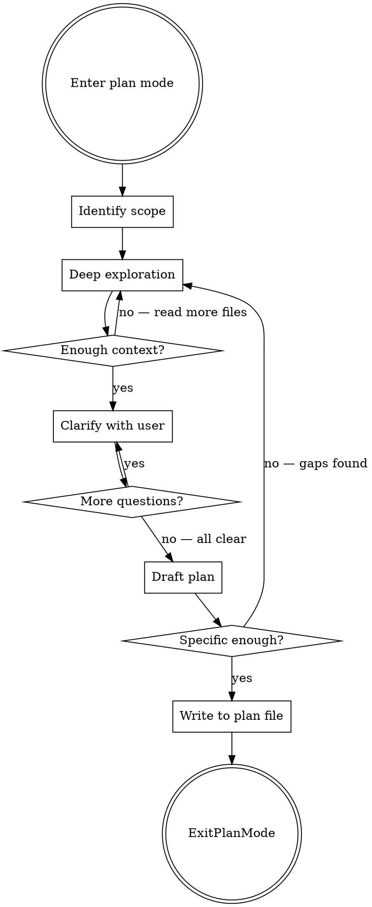

# Plan Mode Plans

## Overview

Write specific, actionable, **self-contained** plans in plan mode. The plan must be usable by a fresh session with zero prior context — if you looked something up during exploration, the findings go **in the plan**.

**Core principle:** Explore first, plan second. If you haven't read the files, you can't plan the changes. If the context isn't in the plan, it doesn't survive context clearing.

## Process Flow



## Phase 1: Identify Scope

Before reading anything, state:
- **What** needs to change (feature/fix/refactor)
- **Where** it likely lives (educated guess from project structure)
- **What you don't know** yet (explicit unknowns)

## Phase 2: Deep Exploration

**Minimum exploration before writing any plan:**

1. **Find all relevant files** — use Glob/Grep to locate code that touches the area
2. **Read the actual code** — not just file names. Read the functions, interfaces, types
3. **Trace the data flow** — follow how data moves through the relevant paths
4. **Check for patterns** — how does the codebase handle similar things already?
5. **Find tests** — what existing test patterns and infrastructure exist?
6. **Fetch external references** — if the task involves a library, API, or tool, fetch the relevant docs and inline key syntax/signatures into the plan. Do NOT assume the executing session will "just look it up"
7. **Link the origin** — find the GitHub issue, PR, or conversation that motivated this work

**Use parallel subagents** for independent exploration tasks (e.g., searching for types AND finding test files AND fetching library docs simultaneously). Prefer the focused explorers over `general-purpose`: `code-explorer` for local-codebase research, `github-explorer` for GitHub repos (code, issues, PRs, releases), `web-explorer` for library/framework/API docs and general web research. Each has tighter tool allowlists and discipline baked into its system prompt.

### Exploration Red Flags — Go Back and Read More

- You're about to write "update the relevant files" without naming them
- You reference a function you haven't read
- You assume an interface shape without checking
- You don't know where tests live for this area
- You haven't checked how similar features were implemented
- You looked up docs/syntax during exploration but haven't saved the key findings anywhere yet
- There's a GitHub issue or PR motivating this work and you haven't linked it

## Phase 3: Clarify With the User

**After exploration, ALWAYS ask clarifying questions before drafting.** Even if the task seems clear — exploration often reveals ambiguities, trade-offs, or assumptions worth verifying. It's cheaper to ask now than to rewrite the plan or waste an execution cycle.

**What to surface:**
- **Ambiguities** — anything with multiple valid interpretations ("should this be a new component or extend the existing one?")
- **Trade-offs you discovered** — present options with pros/cons from what you found in the code ("the codebase uses pattern X for similar things, but pattern Y might be cleaner here — preference?")
- **Assumptions you're about to make** — state them explicitly and ask if they're correct ("I'm assuming we want to keep backward compatibility with the v1 API — right?")
- **Scope questions** — things that could be in or out ("should this also handle the edge case where X? or keep it simple for now?")

**How to ask:**
- Use AskUserQuestion with concrete options informed by your exploration
- One question at a time — don't dump a wall of questions
- Lead with your recommendation when you have one
- Keep going until you're confident you understand the intent

**When you think there's nothing to ask**, ask yourself: "If I draft this plan and they reject it, what would the reason be?" That's your question.

**Before moving to Phase 4**, check: "Am I about to put anything in a 'Risks' or 'Open Questions' section that I could resolve right now by asking?" If yes, ask it here. The Risks section in the plan should only contain things that are genuinely unknowable — not things you were too lazy to clarify.

## Phase 4: Draft the Plan

### Required Sections

Note: The Decisions table should now reflect choices **confirmed with the user** during Phase 3, not just your own analysis.

Every plan MUST include:

```markdown
## Goal
[One sentence. What does "done" look like?]

## Context
- **Issue:** [Link to GitHub issue, ticket, or description of the request — omit if none]
- **Related code:** [Links to PRs, existing implementations, or examples referenced]

## Documentation Referenced
- [Library/API name](URL) — [what was learned, e.g., "streaming API accepts AsyncThrowingStream<Data>"]
- [Library/API name](URL) — [key detail]

Link every external doc, API reference, or library README consulted during exploration.
This is the breadcrumb trail — if an API changes or something doesn't work as expected,
the implementing session needs to know where the information came from.

## Skills & Tools
- **Skills:** [List skills the executing session should invoke, e.g., `superpowers:test-driven-development`, `writing-mise-tasks`]
- **Tools:** [List MCP servers, CLI tools, or specific tooling needed, e.g., "use `xcsift` for build output", "use context7 for API docs", "use GitHub MCP for issue updates"]

Explicitly call out what the executing session should reach for. Don't assume it will
discover these on its own — a fresh session won't have the planning context that made
these choices obvious.

## Assumptions
- [Assumption 1 — what we believe to be true and why]
- [Assumption 2 — if this is wrong, revisit step N]

## Decisions
| Decision | Options Considered | Chosen | Rationale |
|---|---|---|---|
| [e.g., State management] | [Redux, Zustand, Context] | [Zustand] | [Lightweight, fits existing patterns in `src/store/`] |

## Files Affected
- `exact/path/to/file.ts:45-67` — [what changes and why]
- `exact/path/to/other.ts` — [new file / what it contains]
- `tests/exact/path.test.ts` — [what test coverage is added]

## Approach
[2-4 paragraphs max. HOW you'll implement this, referencing actual code structures
you found during exploration. Name the functions, types, and patterns involved.]

## Key Syntax & Patterns
[Inline the actual API signatures, code patterns, or syntax discovered during
exploration that the implementation will need. Do NOT rely on "go look up the docs" —
the executing session won't have your exploration context.]

## Steps
1. [Specific action with file path]
2. [Specific action with file path]
3. [Run tests / verify]
...

## Risks
- [Only things that are genuinely unknowable at planning time despite best-effort research]
- [If assumption X is wrong, the fallback is Y]
```

**"Open Questions" belong in Phase 3, not here.** If you can ask the user about it, it's not a risk — it's an unanswered question you should have asked during clarification. Use AskUserQuestion in Phase 3 to resolve questions BEFORE drafting.

**If you can look it up, it's not a risk either.** API rate limits? Check the docs. Library compatibility? Check the README. Don't label something as a risk just because you didn't bother to verify it.

This section is ONLY for:
- True runtime unknowns that can't be answered until implementation (e.g., "actual latency under production load")
- Things you researched, couldn't find a definitive answer, AND asked the user who said "let's figure it out during implementation"

If you find yourself writing an "open question" here, STOP — either ask the user (Phase 3) or go research it (Phase 2).

### Code Snippets Are Required

Steps that involve code changes MUST include a concrete code snippet showing the change. Snippets serve as **proof of understanding** — they let the user verify you actually know what functions exist, what types look like, and what API calls to make.

**Snippets must be real code, not wishful thinking:**
- Use actual function names, types, and signatures from exploration
- Show the key logic, not the entire file
- Never include placeholder comments like `// TODO: figure this out` or `# Handle the edge cases here`

If you can't write the snippet, you haven't explored enough. Go back to Phase 2.

**Good snippet (shows real understanding):**
```typescript
// In src/components/Form.tsx — add to handleSubmit at line 34
const validated = userSchema.safeParse(formData);
if (!validated.success) {
  setErrors(validated.error.flatten().fieldErrors);
  return;
}
await createUser(validated.data);
```

**Bad snippet (placeholder garbage):**
```typescript
// Add validation logic here
// Parse the form data and handle errors
// Then call the API
```

If a step involves creating or modifying code and has no snippet, the plan is incomplete.

### Specificity Requirements

| Vague (reject) | Specific (accept) |
|---|---|
| "Update the handler" | "Add validation to `handleSubmit` in `src/components/Form.tsx:34`" |
| "Add tests" | "Add test case to `tests/form.test.ts` using the existing `renderForm` helper" |
| "Modify the type" | "Extend `UserProfile` in `src/types.ts:12` with optional `displayName: string`" |
| "Update the config" | "Add `newFeature: true` to `FeatureFlags` in `src/config.ts:8`" |
| "Fix the API call" | "Change `fetch('/api/old')` to `fetch('/api/new')` in `src/api/client.ts:89`" |

**Rule:** If a step doesn't include a file path, it's not specific enough.

### Alternatives (When Applicable)

If there are genuinely different approaches (not just one obvious path), present 2-3 options:

```markdown
## Approach A: [Name]
- Pros: ...
- Cons: ...

## Approach B: [Name]
- Pros: ...
- Cons: ...

**Recommendation:** Approach A because [concrete reason].
```

Don't force alternatives when there's clearly one right answer.

## Phase 5: Write and Exit

1. Write the plan to the plan file (as specified by plan mode)
2. Call ExitPlanMode for user approval

## The Self-Containment Test

Before calling ExitPlanMode, ask yourself:

> If a fresh session reads ONLY this plan file with zero prior context, can it start implementing immediately without looking anything up?

If the answer is no, the plan is missing context. Common gaps:
- API syntax you verified during exploration but didn't inline
- Library documentation you consulted but only linked (link AND quote the key parts)
- GitHub issue context that motivated design decisions
- Assumptions that feel "obvious" because you just explored the code
- Code snippets that reference functions or types you haven't verified exist
- You consulted external docs but didn't link them in "Documentation Referenced"

## Common Mistakes

| Mistake | Fix |
|---|---|
| Start writing plan before exploring | Explore FIRST. Read files, trace code paths |
| Reference files you haven't read | Read every file you mention in the plan |
| Skip test strategy | Always include which test files and what coverage |
| Overly long plans | Keep it concise. Steps should be scannable |
| No risks section | Always flag unknowns and edge cases |
| Plan says "update" without specifics | Name the function, line, and exact change |
| Looked up docs but didn't inline findings | The executing session won't have your exploration context. Inline key syntax, signatures, and patterns |
| No assumptions section | Always document what you assumed to be true and why |
| No decision rationale | Always explain what options were considered and why the chosen approach won |
| Missing issue/PR links | Link the origin — the executing session needs to understand *why* this work exists |
| Steps describe code changes but have no snippets | Every code-changing step needs a concrete snippet showing the actual change |
| Snippets contain placeholder comments | If you wrote `// handle errors here` instead of actual error handling, you haven't finished exploring |
| No documentation links | If you consulted docs during exploration, link them in "Documentation Referenced" with what you learned |
| "Open questions" in Risks section | If you could have asked the user or looked it up, it's not a risk. Go back to Phase 3 or Phase 2 |
| Risks that are just unverified assumptions | "API might have rate limits" — go check the docs. Don't list it as a risk when 30 seconds of research would give you the answer |
