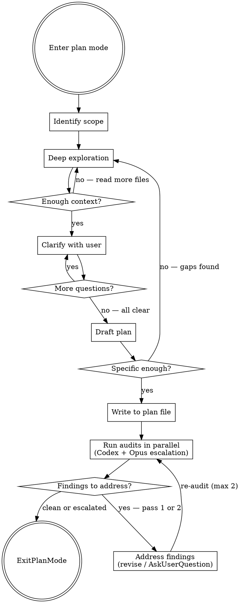

# Plan Mode Plans

## Overview

Write specific, actionable, **self-contained** plans in plan mode. The plan must be usable by a fresh session with zero prior context — if you looked something up during exploration, the findings go **in the plan**.

**Core principle:** Explore first, plan second. If you haven't read the files, you can't plan the changes. If the context isn't in the plan, it doesn't survive context clearing.

## Variant Selection (read FIRST)

This skill covers four variants. Pick based on the task shape, then load the matching reference files alongside this SKILL.md.

| Task shape | TDD requested? | Variant | Load these references |
|---|---|---|---|
| 1–2 focused areas, single session | No | **Single** (default) | `references/single-session.md` |
| 1–2 focused areas, single session | Yes | **TDD (single)** | `references/single-session.md` + `references/tdd-cycles.md` |
| 3+ independent areas, agent team | No | **Agent Teams** | `references/agent-teams.md` |
| 3+ independent areas, agent team | Yes | **Agent Teams + TDD** | `references/agent-teams.md` + `references/tdd-cycles.md` + `references/agent-teams-tdd.md` |

How to decide:
- **Areas**: count distinct subsystems / layers / domains the task touches based on initial read. 3+ → agent teams. (See `references/agent-teams.md` Decomposition Strategies for examples.)
- **TDD**: load TDD references only if the user explicitly asked for TDD-structured plans, OR the project has strong TDD culture confirmed during exploration. Don't impose TDD on a project that doesn't already use it.

If you're unsure, default to Single. Switch variants mid-planning if the task shape changes — it's cheaper to reload references than to write the wrong kind of plan.

## Process Flow



## Phase 1: Identify Scope

Before reading anything, state:
- **What** needs to change (feature/fix/refactor)
- **Where** it likely lives (educated guess from project structure)
- **What you don't know** yet (explicit unknowns)

## Phase 2: Deep Exploration

**Minimum exploration before writing any plan:**

1. **Find all relevant files** — use Glob/Grep to locate code that touches the area
2. **Read the actual code** — not just file names. Read the functions, interfaces, types
3. **Trace the data flow** — follow how data moves through the relevant paths
4. **Check for patterns** — how does the codebase handle similar things already?
5. **Find tests** — what existing test patterns and infrastructure exist?
6. **Fetch external references** — if the task involves a library, API, or tool, fetch the relevant docs and inline key syntax/signatures into the plan. Do NOT assume the executing session will "just look it up"
7. **Link the origin** — find the GitHub issue, PR, or conversation that motivated this work

**Use parallel subagents** for independent exploration tasks (e.g., searching for types AND finding test files AND fetching library docs simultaneously). Prefer the focused explorers over `general-purpose`: `code-explorer` for local-codebase research, `github-explorer` for GitHub repos (code, issues, PRs, releases), `web-explorer` for library/framework/API docs and general web research. Each has tighter tool allowlists and discipline baked into its system prompt.

**For agent-teams variants**, exploration happens via spawned teammates rather than the lead doing all the reads. See `references/agent-teams.md` for the spawn-prompt requirements, monitoring/synthesis loop, and the decomposition strategies for choosing teammate roles. The Phase 2 list above still applies — teammates follow it within their assigned areas.

**For TDD variants**, also identify the test framework, runner, file conventions, and existing test helpers during exploration. See `references/tdd-cycles.md` Additional Exploration Requirements.

### Exploration Red Flags — Go Back and Read More

- You're about to write "update the relevant files" without naming them
- You reference a function you haven't read
- You assume an interface shape without checking
- You don't know where tests live for this area
- You haven't checked how similar features were implemented
- You looked up docs/syntax during exploration but haven't saved the key findings anywhere yet
- There's a GitHub issue or PR motivating this work and you haven't linked it

## Phase 3: Clarify With the User

**Exploration almost always surfaces ambiguities, trade-offs, or assumptions worth verifying — assume there's something to clarify before drafting.** It's cheaper to ask now than to rewrite the plan or waste an execution cycle. If you're convinced there's nothing to ask, run the rejection test: "If the user rejects this plan, what's the most likely reason?" That reason is your question.

**What to surface:**
- **Ambiguities** — anything with multiple valid interpretations ("should this be a new component or extend the existing one?")
- **Trade-offs you discovered** — present options with pros/cons from what you found in the code ("the codebase uses pattern X for similar things, but pattern Y might be cleaner here — preference?")
- **Assumptions you're about to make** — state them explicitly and ask if they're correct ("I'm assuming we want to keep backward compatibility with the v1 API — right?")
- **Scope questions** — things that could be in or out ("should this also handle the edge case where X? or keep it simple for now?")

**How to ask:**
- Use AskUserQuestion with concrete options informed by your exploration
- One question at a time — don't dump a wall of questions
- Lead with your recommendation when you have one
- Keep going until you're confident you understand the intent

**When you think there's nothing to ask**, ask yourself: "If I draft this plan and they reject it, what would the reason be?" That's your question.

**Before moving to Phase 4**, check: "Am I about to put anything in a 'Risks' or 'Open Questions' section that I could resolve right now by asking?" If yes, ask it here. The Risks section in the plan should only contain things that are genuinely unknowable — not things you were too lazy to clarify.

## Phase 4: Draft the Plan

### Required Sections

Note: The Decisions table should now reflect choices **confirmed with the user** during Phase 3, not just your own analysis.

Every plan MUST include:

```markdown
## Goal
[One sentence. What does "done" look like?]

## Context
- **Issue:** [Link to GitHub issue, ticket, or description of the request — omit if none]
- **Related code:** [Links to PRs, existing implementations, or examples referenced]

## Documentation Referenced
- [Library/API name](URL) — [what was learned, e.g., "streaming API accepts AsyncThrowingStream<Data>"]
- [Library/API name](URL) — [key detail]

Link every external doc, API reference, or library README consulted during exploration.
This is the breadcrumb trail — if an API changes or something doesn't work as expected,
the implementing session needs to know where the information came from.

## Skills & Tools
- **Skills:** [List skills the executing session should invoke, e.g., `superpowers:test-driven-development`, `writing-mise-tasks`]
- **Tools:** [List MCP servers, CLI tools, or specific tooling needed, e.g., "use `xcsift` for build output", "use context7 for API docs", "use GitHub MCP for issue updates"]

Explicitly call out what the executing session should reach for. Don't assume it will
discover these on its own — a fresh session won't have the planning context that made
these choices obvious.

## Assumptions
- [Assumption 1 — what we believe to be true and why]
- [Assumption 2 — if this is wrong, revisit step N]

## Decisions
| Decision | Options Considered | Chosen | Rationale |
|---|---|---|---|
| [e.g., State management] | [Redux, Zustand, Context] | [Zustand] | [Lightweight, fits existing patterns in `src/store/`] |

## User-Confirmed Decisions (when applicable)
| Question | User's Answer | Captured From |
|---|---|---|
| [Question from escalation audit or Phase 3 clarification] | [User's choice] | [Phase 3 / Phase 4.5 ESCALATE finding] |

Only include this section when the user answered an AskUserQuestion (Phase 3 or
Phase 4.5 ESCALATE) whose answer doesn't fit cleanly into the Decisions table
above. Omit if empty.

## Files Affected
- `exact/path/to/file.ts:45-67` — [what changes and why]
- `exact/path/to/other.ts` — [new file / what it contains]
- `tests/exact/path.test.ts` — [what test coverage is added]

## Approach
[2-4 paragraphs max. HOW you'll implement this, referencing actual code structures
you found during exploration. Name the functions, types, and patterns involved.]

## Key Syntax & Patterns
[Inline the actual API signatures, code patterns, or syntax discovered during
exploration that the implementation will need. Do NOT rely on "go look up the docs" —
the executing session won't have your exploration context.]

## Steps
1. [Specific action with file path]
2. [Specific action with file path]
3. [Run tests / verify]
...

## Risks
- [Only things that are genuinely unknowable at planning time despite best-effort research]
- [If assumption X is wrong, the fallback is Y]

## Verification
After implementation, verify before declaring done:
- Run tests: `<exact test command from exploration>`
- Run static review on the diff: `coderabbit review --agent` (or `cr review --agent`)
  - Fix Critical and Warning findings before merge.
  - If `coderabbit --version` fails or CodeRabbit isn't authenticated, skip with a note (CR is opt-in per project).
- [Any domain-specific verification — e.g., `chezmoi apply` for dotfile changes, `xcodebuild build | xcsift` for iOS, `nph` for Nim formatting]
```

**"Open Questions" belong in Phase 3, not here.** If you can ask the user about it, it's not a risk — it's an unanswered question you should have asked during clarification. Use AskUserQuestion in Phase 3 to resolve questions BEFORE drafting.

**If you can look it up, it's not a risk either.** API rate limits? Check the docs. Library compatibility? Check the README. Don't label something as a risk just because you didn't bother to verify it.

This section is ONLY for:
- True runtime unknowns that can't be answered until implementation (e.g., "actual latency under production load")
- Things you researched, couldn't find a definitive answer, AND asked the user who said "let's figure it out during implementation"

If you find yourself writing an "open question" here, STOP — either ask the user (Phase 3) or go research it (Phase 2).

### Code Snippets Are Required

Steps that involve code changes MUST include a concrete code snippet showing the change. Snippets serve as **proof of understanding** — they let the user verify you actually know what functions exist, what types look like, and what API calls to make.

**Snippets must be real code, not wishful thinking:**
- Use actual function names, types, and signatures from exploration
- Show the key logic, not the entire file
- Never include placeholder comments like `// TODO: figure this out` or `# Handle the edge cases here`

If you can't write the snippet, you haven't explored enough. Go back to Phase 2.

**Good snippet (shows real understanding):**
```typescript
// In src/components/Form.tsx — add to handleSubmit at line 34
const validated = userSchema.safeParse(formData);
if (!validated.success) {
  setErrors(validated.error.flatten().fieldErrors);
  return;
}
await createUser(validated.data);
```

**Bad snippet (placeholder garbage):**
```typescript
// Add validation logic here
// Parse the form data and handle errors
// Then call the API
```

If a step involves creating or modifying code and has no snippet, the plan is incomplete.

### Variant-Specific Steps Format

The Steps section above (a flat numbered list) is the default for **Single** variants. For TDD variants, replace it with red-green-refactor cycles per `references/tdd-cycles.md` Steps Section Format. For Agent Teams variants, the plan is a directory with `index.md` + numbered section files instead of a single flat list — see `references/agent-teams.md` Multi-File Plan Output.

### Specificity Requirements

| Vague (reject) | Specific (accept) |
|---|---|
| "Update the handler" | "Add validation to `handleSubmit` in `src/components/Form.tsx:34`" |
| "Add tests" | "Add test case to `tests/form.test.ts` using the existing `renderForm` helper" |
| "Modify the type" | "Extend `UserProfile` in `src/types.ts:12` with optional `displayName: string`" |
| "Update the config" | "Add `newFeature: true` to `FeatureFlags` in `src/config.ts:8`" |
| "Fix the API call" | "Change `fetch('/api/old')` to `fetch('/api/new')` in `src/api/client.ts:89`" |

**Rule:** If a step doesn't include a file path, it's not specific enough.

### Alternatives (When Applicable)

If there are genuinely different approaches (not just one obvious path), present 2-3 options:

```markdown
## Approach A: [Name]
- Pros: ...
- Cons: ...

## Approach B: [Name]
- Pros: ...
- Cons: ...

**Recommendation:** Approach A because [concrete reason].
```

Don't force alternatives when there's clearly one right answer.

## Phase 4.5: Independent Plan Audits (default-on)

After writing the draft to the plan file, run **two parallel audits** before calling ExitPlanMode. They review different things and shouldn't block each other:

1. **Codex audit** (`codex:codex-rescue`) — fresh-eyes implementation review. Catches wrong code references, missing context, broken snippets, false assumptions about the code. Variant-specific prompt.
2. **Opus escalation audit** (`general-purpose` agent with `model: "opus"`) — adversarial review focused on user-attention items. Catches accepted regressions, scope reductions, breaking changes, and decisions the planner made on the user's behalf without surfacing them. Variant-agnostic prompt.

The two audits answer different questions. Codex asks "is this plan technically correct?" Escalation asks "did the planner sneak past anything the user must approve?" The escalation audit exists because the technical-correctness review tends to defer to the planner's framing of tradeoffs ("regression is fine because X") instead of escalating to the user.

**Bypass:** If the user said "skip audit" / "skip audits" / "skip codex audit" / similar in this plan mode session, omit BOTH passes and add a single line to the plan's Risks section: "Plan audits skipped per user request." Default behavior is to run both.

**Procedure:**

1. Compose the prompts per `references/audit-prompts.md` — that file owns the (variant × TDD) → file composition table and the TDD-additions renumbering rules.
2. **Spawn both audits in parallel** — single message, two `Agent` tool calls. Phrase the Codex prompt without `--write` keywords (the rescue agent strips routing flags; read-only is the codex default). The escalation audit uses `subagent_type: "general-purpose"` with `model: "opus"` — Opus tier matters here for spotting motivated reasoning, don't downgrade.
3. Read both sets of findings.
4. **Codex CRITICAL / WARNING findings → revise the plan.** Edit the plan file directly (the only file editable in plan mode). Per `codex-result-handling`, do NOT auto-apply Codex's suggested fixes to source code — the audit reviews the plan, not the source.
5. **Escalation ESCALATE findings → use AskUserQuestion for each one** before ExitPlanMode. Do NOT silently fold them into the Risks section, do NOT rationalize them away, and do NOT batch them into a wall of questions — one AskUserQuestion per finding (or grouped tightly when they share an option set). After the user answers, capture the decision in the plan's Decisions table or, when answers don't fit existing decisions, in a `## User-Confirmed Decisions` section so a fresh session can see the user's sign-off.
6. **Escalation VERIFY findings → mention briefly in your ExitPlanMode summary** so the user has visibility, but they're not blocking. Don't pre-emptively edit the plan based on them.
7. **After revisions, re-run BOTH audits ONCE more** (cap at 2 total passes per audit). If the second pass still surfaces CRITICAL or unresolved ESCALATE findings, escalate to the user via AskUserQuestion before ExitPlanMode rather than starting a third pass.
8. If only Info / OK / VERIFY findings remain, list any non-blocking items in the plan's Risks section as "Audit Info notes (non-blocking): ..." and proceed to Phase 5.
9. **Partial-failure handling:** If only one audit agent is unavailable (auth error, runtime failure, agent not registered), proceed with the one that ran and note the partial coverage in the plan's Risks section ("Codex audit unavailable — escalation pass only" or vice versa). If both fail, surface to the user and offer to skip-with-note rather than retrying indefinitely.

After both audits clear, run the sanity gate:

```bash
check-plan <plan-file-or-directory>
```

`check-plan` is a small Nim binary on PATH (built by chezmoi from `scripts/claude/check_plan.nim`). It catches missing required template sections (Goal, Context, Decisions, Files Affected, Approach, Risks, Verification) and missing audit evidence (Phase 4.5 reference, Audit Info notes, escalation audit mention, or explicit skip note). Exit 0 = pass; non-zero = fix the plan and re-audit.

## Phase 5: Write and Exit

1. Write the plan to the plan file (as specified by plan mode)
2. Call ExitPlanMode for user approval

## The Self-Containment Test

Before calling ExitPlanMode, ask yourself:

> If a fresh session reads ONLY this plan file with zero prior context, can it start implementing immediately without looking anything up?

If the answer is no, the plan is missing context. Common gaps:
- API syntax you verified during exploration but didn't inline
- Library documentation you consulted but only linked (link AND quote the key parts)
- GitHub issue context that motivated design decisions
- Assumptions that feel "obvious" because you just explored the code
- Code snippets that reference functions or types you haven't verified exist
- You consulted external docs but didn't link them in "Documentation Referenced"
- You skipped Phase 4.5 without the user explicitly opting out, and the plan never got a second-opinion read
- The escalation audit surfaced ESCALATE findings and you folded them into Risks instead of asking the user — every ESCALATE needs an AskUserQuestion before ExitPlanMode

## Common Mistakes

### Exploration mistakes

| Mistake | Fix |
|---|---|
| Start writing plan before exploring | Explore FIRST. Read files, trace code paths |
| Reference files you haven't read | Read every file you mention in the plan |
| Looked up docs but didn't inline findings | The executing session won't have your exploration context. Inline key syntax, signatures, and patterns |
| Missing issue/PR links | Link the origin — the executing session needs to understand *why* this work exists |
| No documentation links | If you consulted docs during exploration, link them in "Documentation Referenced" with what you learned |

### Drafting mistakes

| Mistake | Fix |
|---|---|
| Skip test strategy | Always include which test files and what coverage |
| Overly long plans | Keep it concise. Steps should be scannable |
| Plan says "update" without specifics | Name the function, line, and exact change |
| Steps describe code changes but have no snippets | Every code-changing step needs a concrete snippet showing the actual change |
| Snippets contain placeholder comments | If you wrote `// handle errors here` instead of actual error handling, you haven't finished exploring |
| No assumptions section | Always document what you assumed to be true and why |
| No decision rationale | Always explain what options were considered and why the chosen approach won |
| No risks section | Always flag unknowns and edge cases |
| "Open questions" in Risks section | If you could have asked the user or looked it up, it's not a risk. Go back to Phase 3 or Phase 2 |
| Risks that are just unverified assumptions | "API might have rate limits" — go check the docs. Don't list it as a risk when 30 seconds of research would give you the answer |
| Plan has no Verification section | Required. Without it, the executing session has no checkpoint after implementation. |

### Audit mistakes

| Mistake | Fix |
|---|---|
| Skipped Phase 4.5 audits on a non-trivial plan | Default is to run BOTH audits. Only skip when user explicitly says so. Note the skip in Risks. |
| Ran only the Codex audit, skipped the escalation pass | They review different things — Codex catches "wrong code", escalation catches "wrong decision the user didn't approve". Skipping escalation is how regressions silently ship. |
| Treated audit findings as authoritative | Codex and the Opus auditor are peers, not oracles. Per `codex-result-handling`, evaluate findings critically before applying. |
| Auto-applied source-code "fixes" from an audit | Both audits review the plan, not the source. Only edit the plan file in plan mode. |
| Folded ESCALATE findings into the Risks section | The whole point of the escalation audit is to surface decisions the planner buried. Every ESCALATE finding requires AskUserQuestion before ExitPlanMode and the answer captured in Decisions. Don't accept the planner's framing of "this regression is fine." |
| Spawned audits sequentially | They're independent reviews — spawn in a single message with two `Agent` tool calls so they run in parallel. |
| Downgraded the escalation audit to Sonnet | Opus tier matters for spotting motivated reasoning and rationalized tradeoffs. Don't trade audit quality for tokens. |
| Audit loop without a cap | 2-pass cap per audit is hard. After that, escalate remaining Critical / ESCALATE findings to the user via AskUserQuestion. |
